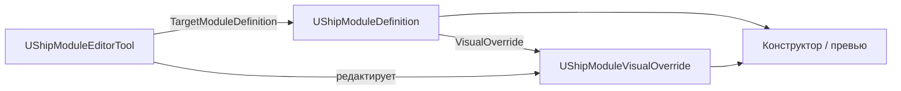

# Руководство: модуль корабля на базе Big Modular SciFi Interior

Как собрать визуал и данные модуля для конструктора SpaceshipCrew, используя меши из  
`Content/ThirdParty/BigModularSciFi/` (пак не в git — см. [Content/THIRD_PARTY_ASSETS.md](../Content/THIRD_PARTY_ASSETS.md)).

Связанные документы:

- [SHIP_BUILDER_GRID_RU.md](SHIP_BUILDER_GRID_RU.md) — сетка 400×400×300, `CellSize`, `GridPos`, стыковка, проёмы, schema v2
- [SHIP_VALIDATION.md](SHIP_VALIDATION.md) — обязательные типы модулей для полёта
- [Content/THIRD_PARTY_ASSETS.md](../Content/THIRD_PARTY_ASSETS.md) — установка пака

---

## 1. Как это устроено в проекте

| Ассет | Путь | Роль |
|-------|------|------|
| **Ship Module Definition** | `Content/Data/ShipModules/` | Логика: `ModuleId`, тип, масса, `CellSize`/`Size`, стыковка, ссылка на override |
| **Ship Module Visual Override** | рядом, суффикс `_VisualOverride` | Визуал: список мешей + опционально сокеты |
| **Ship Module Editor Tool** | `Content/Data/ShipModules/` | Редактор с вьюпортом: расстановка мешей и сокетов |

Пак Big Modular **не копируется** в `Content/Data/` — оттуда только **ссылки** на `UStaticMesh` из  
`/Game/ThirdParty/BigModularSciFi/...`.

---

## 2. Координаты и размер модуля

### Локальная система модуля

- **Центр модуля** = `(0, 0, 0)` в локальных координатах.
- Все `VisualParts[].RelativeTransform` — относительно центра.
- **`Size`** — габарит bbox в **сантиметрах** (read-only в Details, пересчитывается из `CellSize`).
- **`CellSize`** — размер в **панелях сетки** (`FIntVector`). Одна панель = **400 × 400 × 300 см**.

| CellSize | Size (см) |
|----------|-----------|
| 1×1×1 | 400 × 400 × 300 |
| 1×3×1 | 400 × 1200 × 300 |
| 2×3×2 | 800 × 1200 × 600 |

Задавайте **`CellSize`** в Definition — `Size` и panel-sockets обновятся автоматически (см. [SHIP_BUILDER_GRID_RU.md](SHIP_BUILDER_GRID_RU.md)).

### Panel-sockets (стыковка)

На каждой внешней панели грани — contact point с именем `{Face}_X{ix}_Y{iy}_Z{iz}` (например `Front_X0_Y0_Z0`).  
Legacy-имена (`Front`, `Back`, …) поддерживаются для совместимости.

Центр сокета — на **внешней грани** панели (не в центре всего модуля).

Для модуля **1×1×1** (Size = 400×400×300):

| Имя (legacy) | Ось | RelativeLocation |
|--------------|-----|------------------|
| Front | +X | `(200, 0, 0)` |
| Back | −X | `(-200, 0, 0)` |
| Left | −Y | `(0, -200, 0)` |
| Right | +Y | `(0, 200, 0)` |
| Top | +Z | `(0, 0, 150)` |
| Bottom | −Z | `(0, 0, -150)` |

### bHasInterior

| Значение | Превью в конструкторе |
|----------|------------------------|
| **`true`** | Panel-shell (стены/пол/потолок по панелям), проёмы на стыках |
| **`false`** | Цельный bbox-меш по `Size` (оболочка, блок без прохода) |

К модулю **с объёмом**, пристыкованному к **сплошному** (`bHasInterior=false`), проём **не** режется со стороны interior-модуля.

Перед сборкой откройте демо пака:  
`Content/ThirdParty/BigModularSciFi/Levels/sample.umap` или `AllAssets.umap` — оцените масштаб сегментов коридора.

---

## 3. Справочник папок пака

Корень мешей: `/Game/ThirdParty/BigModularSciFi/Meshes/Modules/`

| Папка | Для модулей типа | Заметки |
|-------|------------------|---------|
| `Corridors/` | `Corridor`, стыки между отсеками | Готовые сегменты коридоров, тоннели |
| `Floorpanels/`, `CeilingPanels/`, `Panels/` | Оболочка любого модуля | Стены, пол, потолок по кускам |
| `Doors/` | Проёмы на стыках | Рамы; анимированные двери — BP в `BluePrints/` (в билдере пока только Static Mesh) |
| `Details/`, `Lights/` | `Bridge`, `ScienceLab`, наполнение | Консоли, генераторы, освещение |
| `Signs/` | Декор / ориентиры | `SM_Sign_EngineRoom` и т.п. |
| `Elevators/`, `Stairs/` | Вертикальные стыки | Сокет `Vertical` / Top–Bottom |
| `Windows/` | `Bridge`, обзорные отсеки | Внешний вид «стены» |
| `ServiceTunnels/` | Узкие `Corridor` | Альтернатива широкому коридору |

Для **внешнего декора** (крылья, большие двигатели) в этом паке мало подходящего — используйте `Details/` (генераторы) или отдельный hull-пак позже. Для MVP интерьера и «стен» этого набора достаточно.

> **Стыковка VisualOverride:** стены с `WallSocketName` при стыковке меняются на `OpeningMesh` (`Passage` / `SlidingDoor`). См. [VISUAL_OVERRIDE_DOCK_OPENINGS_RU.md](VISUAL_OVERRIDE_DOCK_OPENINGS_RU.md).

---

## 4. Пошагово: новый модуль «Коридор»

### Шаг 1 — Ship Module Definition

1. Content Browser → `Content/Data/ShipModules/`.
2. ПКМ → **Miscellaneous** → **Ship Module Definition**.
3. Имя, например: `Corridor_BigModular_01`.
4. Заполните поля:

| Поле | Пример |
|------|--------|
| `ModuleId` | `Corridor_BigModular_01` (уникальный `FName`) |
| `ModuleType` | `Corridor` |
| `DisplayName` | «Коридор (Big Modular)» |
| `Mass` | `120` |
| **`CellSize`** | `1, 1, 1` или `1, 3, 1` для длинного сегмента — **`Size` пересчитается сам** |
| `bHasInterior` | `true` |
| `CompatibleModuleTypes` | `Corridor`, `Bridge`, `Reactor`, … (кто может стыковаться) |

5. Сохраните. При пустых `ContactPoints` редактор создаст panel-sockets по `CellSize`.

### Шаг 2 — Ship Module Editor Tool

1. В той же папке: ПКМ → **Miscellaneous** → **Ship Module Editor Tool**.
2. Имя, например: `EditorTool_Corridor_BigModular_01`.
3. В Details:
   - **Target Module Definition** → `Corridor_BigModular_01`.
   - **Target Visual Override** — пусто (создастся автоматически).
   - **bAuto Assign Override To Definition** — `true`.
4. Дважды щёлкните по Tool — откроется **Ship Module Editor Tool** (вьюпорт + вкладки).

### Шаг 3 — Подобрать эталонный меш и размер

1. В Content Browser откройте  
   `ThirdParty/BigModularSciFi/Meshes/Modules/Corridors/`.
2. Выберите сегмент (например `SM_Corridor013_02_02` — имя может отличаться).
3. В **Static Mesh Editor** → **Bounds** → оцените размер в см.
4. В Definition задайте **`CellSize`**, округлив до целых панелей (400×400×300 см):
   - короткий сегмент ≈ `1, 1, 1`;
   - длинный прямой ≈ `1, 3, 1` или `3, 1, 1` по ориентации.
5. Проверьте, что **Size** в Details совпал с ожиданием (например 400×1200×300 для 1×3×1).
6. При необходимости на Tool: **Copy Contact Points To Override** или ручная правка сокетов (шаг 5).

> **Опционально:** **Generate Or Update Visual Override** создаёт процедурную коробку из кубов Engine — заглушка до финальных мешей пака.

### Шаг 4 — Собрать визуал (вкладка Parts)

1. В редакторе Tool откройте вкладку **Parts**.
2. Добавьте части: из Content Browser, drag & drop или кнопка **Добавить**.
3. **Move (W) / Rotate (E) / Scale (R)** во вьюпорте.
4. Типичная сборка коридора:
   - 1× сегмент `Corridors/SM_Corridor...`;
   - `Floorpanels` + `CeilingPanels` при необходимости;
   - `Lights/` по потолку;
   - `Doors/SM_Door01Frame` в проёме стыка.

5. Toolbar → **Refresh Preview**.

Цель: меши в bbox `Size`; проход на стыке совпадает с panel-socket на грани **Front** (+X) или **Back** (−X).

### Шаг 5 — Стыковочные точки (Socket Edit Mode)

1. Toolbar → **Socket Edit Mode**.
2. **Add Socket** или правка существующих panel-sockets:
   - `SocketName`: `Front_X0_Y0_Z0`, … (или legacy `Front` при необходимости);
   - `RelativeLocation`: центр проёма на грани панели;
   - `SocketType`: `Horizontal` (коридор–коридор); `Vertical` (Top/Bottom, лестницы).
3. **Attach Socket To Panel** — привязка к грани панели.
4. При ручной правке: **`bOverrideContactPoints`** = `true` на override.

Сохраните override и Definition.

### Шаг 6 — Проверка

1. **Data Validation** на Definition (ПКМ → Validate Data).
2. PIE → конструктор корабля → добавьте модуль.
3. Превью: меши пака (или panel-shell), не «сломанный» bbox.
4. Стыковка с соседом: проёмы **с обеих сторон** (если оба `bHasInterior`).

**Примеры в репозитории:** `ModularSciFiCorridor` + `ModularSciFiCorridor_VisualOverride`, `Corridor3x1` (1×3×1, solid shell).

---

## 5. Рецепты по типам модулей

| `EShipModuleType` | Меши из пака | Поля Definition |
|-------------------|--------------|-----------------|
| `Corridor` | `Corridors/`, `Panels/` | `bHasInterior=true` |
| `Bridge` | `Corridors/` + `Details/`, `Lights/` | Комната побольше, `CellSize` шире |
| `Reactor` | `Details/SM_Generator`, панели | `Mass` выше |
| `Engine` | `Details/`, `Signs/` | Декор «машинного» |
| `Airlock` | `Doors/`, короткий `Corridors/` | `ForcedOpeningSide` = сторона выхода |
| `CargoHold` | широкий коридор / `ServiceTunnels/` | Меньше деталей внутри |
| Оболочка / блок | `Panels/` | `bHasInterior=false` — стыкуется, но не даёт проход |

Обязательные типы для **новой игры**: см. [SHIP_VALIDATION.md](SHIP_VALIDATION.md).

---

## 6. Что коммитить в git

| Коммитить | Не коммитить |
|-----------|--------------|
| `Content/Data/ShipModules/*Module*.uasset` | Всё под `Content/ThirdParty/BigModularSciFi/` |
| `*_VisualOverride.uasset` | |
| `*EditorTool*.uasset` | |

---

## 7. Частые проблемы

| Симптом | Решение |
|---------|---------|
| В конструкторе серая коробка | Нет `VisualOverride` / пустой `VisualParts` → Editor Tool |
| Missing mesh | Пак не в `ThirdParty/BigModularSciFi/` |
| Меш 1×1, сокеты на 1×3 | Задайте **Cell Size**, сохраните Definition (см. [SHIP_BUILDER_GRID_RU.md](SHIP_BUILDER_GRID_RU.md)) |
| Стыковка не проходит | Сокеты не на проёме; `CompatibleModuleTypes` / `SocketType` |
| Проём с одной стороны | Оба модуля должны иметь `bHasInterior`; перетащите модуль для пересборки connections |
| Нет проёма к сплошному блоку | Ожидаемо для interior → solid |
| Модуль «плывёт» | Неверный `CellSize`/`Size` или pivot сборки |
| Чертёж сместился после обновления | Миграция schema v1→v2: откройте, сохраните чертёж |
| Анимированная дверь | В билдере только Static Mesh |

---

## 8. Быстрый чеклист

- [ ] Пак в `Content/ThirdParty/BigModularSciFi/`
- [ ] `UShipModuleDefinition` в `Content/Data/ShipModules/`
- [ ] **`CellSize`** задан; **`Size`** согласован
- [ ] `UShipModuleEditorTool` → назначен Definition
- [ ] `VisualParts` или `bHasInterior=false` для блоков
- [ ] Panel-sockets / override contact points
- [ ] Data Validation без ошибок
- [ ] PIE: стыковка и проёмы
- [ ] `git status` — нет файлов из `ThirdParty/BigModularSciFi/`

---

*При расхождении с кодом приоритет у исходников: `ShipModuleDefinition.h`, `ShipBuilderGridConstants.h`, `ShipModuleEditorTool*`.*
